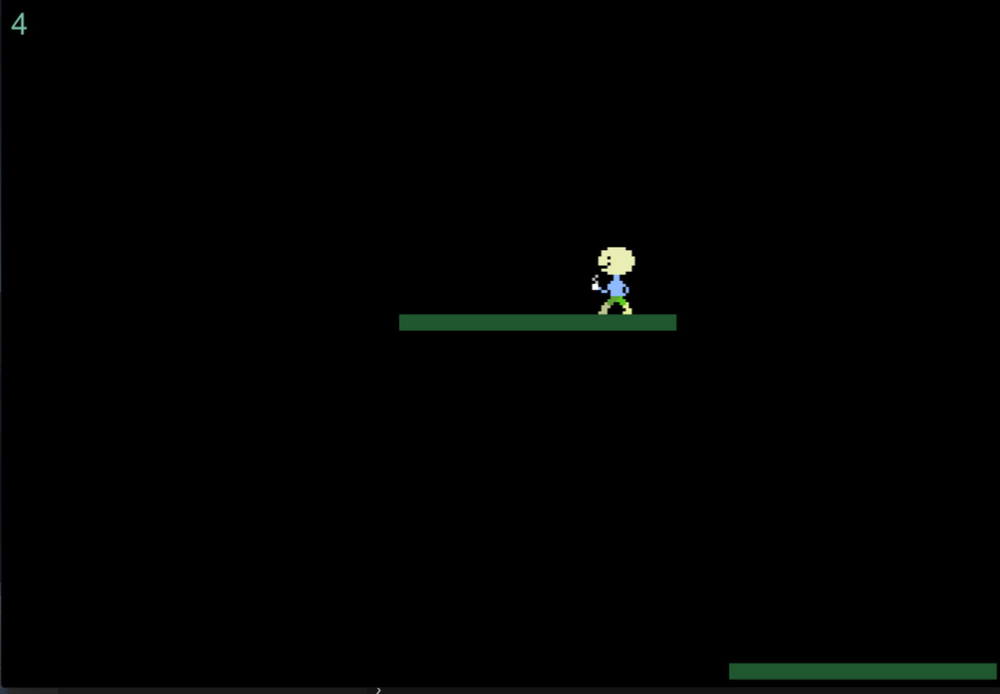

# Falling man (with coffee)

The game is about holding your self over the ground, but not to far. You don't want to hit roof either. 

Looks like this:




This game is made using (https://github.com/lean/phaser-es6-webpack)

## Features
- ESLINT with JavaScript Standard Style configuration
- Next generation of Javascript
- Browsers are automatically updated as you change project files
- Webpack ready
- WebFont Loader


# Setup


## 1. Requirements

- Install node.js and npm (It has only been tested with npm version 6.4.1 and node version 8.0.0)

## 2. Clone this repo:

```git clone https://github.com/moddaman/fallendemann.git```

## 3. Run

run:

```npm install``` 

Then:

```npm run dev```

This will run a server so you can run the game in a browser. It will also start a watch process, so you can change the source and the process will recompile and refresh the browser automatically.

For production build, run:

```npm run deploy```

This will optimize and minimize the compiled bundle.

## Credits
Big thanks to these great repos:

https://github.com/belohlavek/phaser-es6-boilerplate
https://github.com/cstuncsik/phaser-es6-demo
https://github.com/lean/phaser-es6-webpack